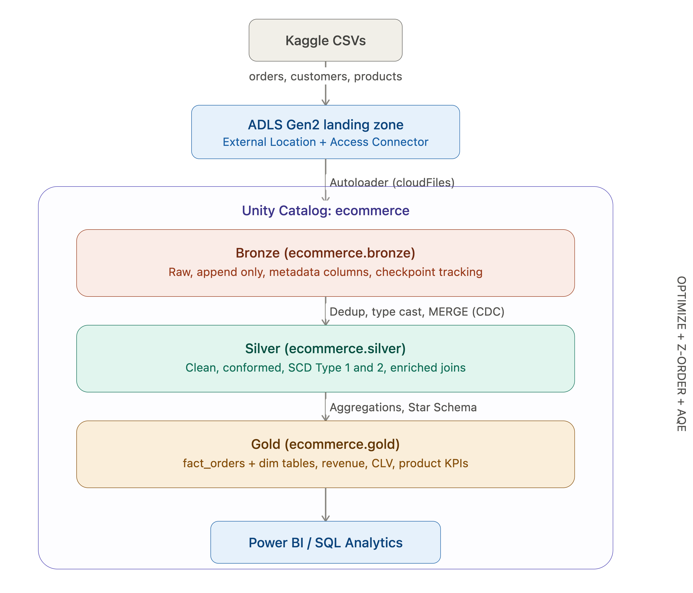

# E-Commerce Delta Lakehouse Pipeline

## Overview
End-to-end Delta Lakehouse pipeline built on Azure Databricks 
using the Brazilian E-Commerce (Olist) dataset from Kaggle.

## Architecture

ADLS Landing Zone (CSVs)
  → Autoloader (cloudFiles, checkpoint, exactly-once)
    → Bronze (raw, append-only, metadata columns)
      → Silver (deduplicated, typed, MERGE for CDC)
        → Gold (Star Schema, aggregations, KPIs)

## Tech Stack
- Azure Databricks (Unity Catalog, Delta Lake)
- Azure Data Lake Storage Gen2
- PySpark, Spark SQL
- Autoloader (cloudFiles)
- Delta Lake (MERGE, Time Travel, OPTIMIZE, Z-ORDER)

## What I Built

### Bronze Layer
- Ingested CSVs via Autoloader with schema inference
- Added metadata columns (_metadata.file_path, ingestion_timestamp)
- Checkpoint-based exactly-once processing

### Silver Layer
- Deduplicated records using ROW_NUMBER window functions
- Type casting, null filtering, data quality checks
- MERGE INTO for CDC (SCD Type 1 and Type 2)
- Enriched fact table joining orders + items + customers

### Gold Layer
- Star Schema: fact_orders + dim_customers, dim_products, dim_date
- Pre-aggregated tables: daily_revenue, customer_lifetime_value, 
  product_performance

### Optimization
- OPTIMIZE for small file compaction
- Z-ORDER for data skipping on high-cardinality columns
- Partition pruning on low-cardinality columns
- AQE for dynamic partition coalescing

### Governance
- Unity Catalog three-level namespace (catalog.schema.table)
- Time Travel (VERSION AS OF, RESTORE)
- DESCRIBE HISTORY for audit trail
- GRANT/REVOKE access control

## Key Learnings
Data Source
Used the Brazilian E-Commerce (Olist) dataset from Kaggle containing orders, customers, and products data. Uploaded CSV files to Azure Data Lake Storage Gen2 as the landing zone.

Foundation Setup
Created a Unity Catalog with a three-level namespace: ecommerce catalog with bronze, silver, and gold schemas. Set up External Locations with Access Connector for ADLS authentication.

Bronze Layer (Raw Ingestion)
Ingested CSV files using Autoloader (spark.readStream.format("cloudFiles")). Configured schema inference, checkpoint location, and directory listing mode. Tested Autoloader's exactly-once guarantee by attempting to reload the same file and confirmed it was skipped due to checkpoint tracking. Added metadata columns (ingestion timestamp, source file path) using withColumn for auditability.

Silver Layer (Cleaning and Transformation)
Cast timestamp columns to proper data types for accurate processing. Used window functions (ROW_NUMBER) to deduplicate records by keeping only the most recent entry per key. Filtered out records with null values in critical columns. Built an enriched table by joining orders, customers, and product data into a single conformed dataset.

Gold Layer (Business Aggregations)
Created dimension tables: dim_customers, dim_products, dim_date. Built fact_orders as the central fact table linking all dimensions in a Star Schema. Developed pre-aggregated reporting tables including monthly revenue, customer lifetime value, and product performance metrics for business consumption.

Governance and Recovery
Used Delta Lake Time Travel (VERSION AS OF) to query historical versions of tables. Verified the ability to restore data to previous states, enabling safe rollback from accidental changes.

What This Project Taught Me
This project gave me hands-on experience with the core Databricks ecosystem: Unity Catalog governance, Autoloader for incremental ingestion, Delta Lake for reliable storage, Medallion Architecture for data organization, and Spark SQL for transformations and aggregations.
